# MeerKAT Galactic Center Data Reduction: Processing Summary

**Date**: 2026-04-15
**PI**: Josh Benabou (UC Berkeley, Safdi group)
**Dataset**: MeerKAT L-band, 800-1400 MHz, ~32,768 channels at 26.123 kHz native resolution
**Target**: Sgr A* / Galactic Center
**Science goal**: Axion-photon conversion search in neutron star magnetospheres

---

## Pipeline Overview

The 17 TB monolithic measurement set (MS) is being processed through a multi-phase pipeline on the Lawrencium HPC cluster (UC Berkeley). The core challenge -- CASA's file-locking preventing parallel access to the monolithic MS -- was solved by serial subband splitting followed by parallel imaging.

```
Phase 0: Reconnaissance & Setup .................. COMPLETE
Phase 1: Subband Splitting (serial) .............. 86/86 COMPLETE
Phase 2: Continuum Subtraction ................... DROPPED (sideband analysis replaces it)
Phase 3a: Dirty Channel Imaging (parallel) ....... 86/86 COMPLETE (32,768 FITS)
Phase 3b: Cleaned Channel Imaging ................ TEST RUNNING (fix validated, production ready)
Phase 5: RFI Flagging ............................ COMPLETE (5.1% channels flagged)
Phase 6: Sanity Checks ........................... NOT STARTED
Phase 7: Axion Search (sideband analysis) ........ SKELETON WRITTEN
```

---

## Phase 0: Reconnaissance & Setup

- Confirmed single SPW with 32,768 channels (856.0-1711.8 MHz)
- Channel width: 26,123.05 Hz (~26.1 kHz)
- Data is pre-calibrated from the MeerKAT archive (DATA column used)
- Software environment: CASA 6.x (modular) via conda (`casa_cookbook` env)
- Imaging: tclean in cube mode (512x512 pixels, 2 arcsec, Briggs robust=0.5)

## Phase 1: Subband Splitting

**Strategy**: Split the monolithic MS into 86 subbands of 383 channels each (~10 MHz per subband), processed serially to avoid file-locking. Once split, all downstream work is fully parallel.

**Method**: `casatasks.split()` with `spw='0:start~end'` channel selection, `datacolumn='data'`.

| Metric | Value |
|--------|-------|
| Total subbands | 86 (indices 0-85) |
| Channels per subband | 383 |
| Completed | 86/86 |
| Time per subband | 80-113 min (median ~88 min) |
| Total split time | ~125 hours (serial) |
| Subband disk usage | ~12 TB total |

**Note**: No TOPO-to-LSRK regridding was performed. The TOPO-LSRK shift is <0.1 channel width within a single observation, so native TOPO frequencies are preserved. LSRK conversion can be done as metadata post-processing.

## Phase 3a: Dirty Imaging (niter=0)

**Strategy**: Use `tclean` in `specmode='cube'` mode to produce a 383-channel image cube per subband in a single call, then export each channel to individual FITS files.

**Parameters**:
- Image size: 512 x 512 pixels
- Cell size: 2 arcsec
- Weighting: Briggs, robust=0.5
- niter: 0 (dirty images)
- savemodel: 'none' (critical -- avoids write locks)
- SLURM: 1 node per subband, 56 cores, 240 GB RAM, lr7 partition

**Status**: COMPLETE -- 32,768 FITS files across 86 subbands.

### Example Dirty Image

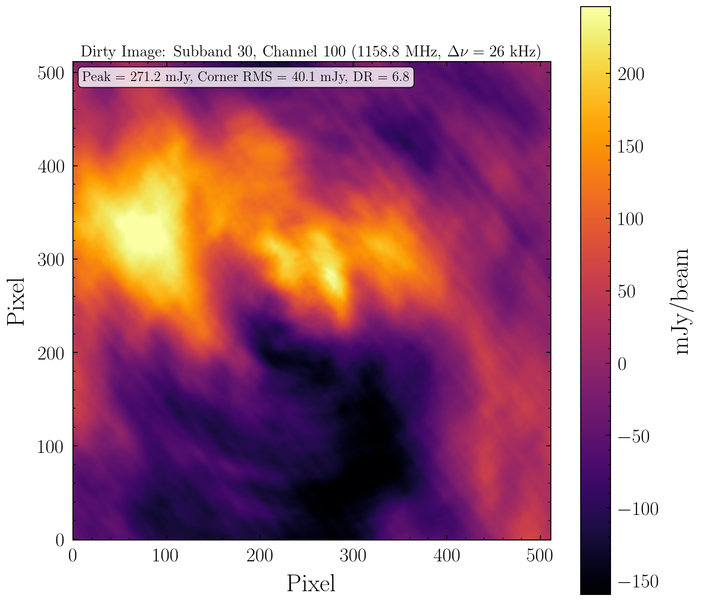

### Noise and Peak Flux vs Frequency

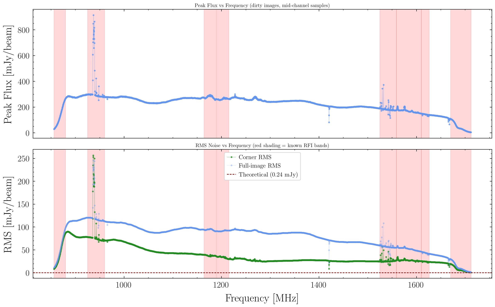

### Beam Size vs Frequency

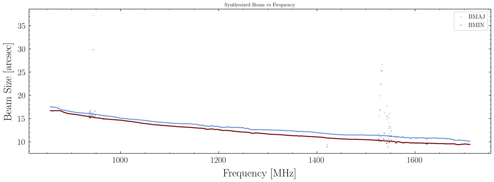

### Cross-Subband Continuity

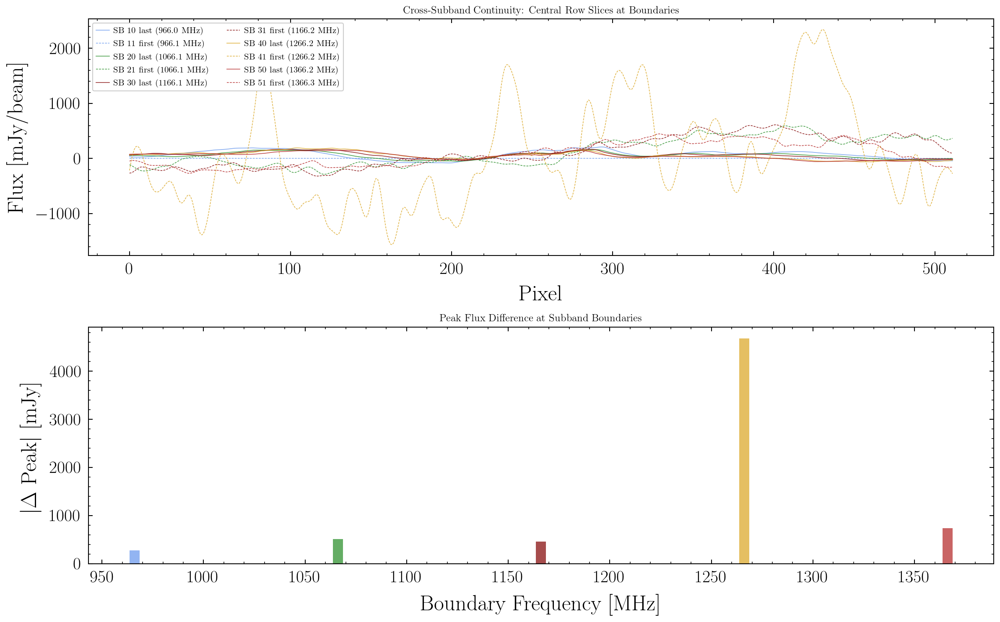

### Frequency-Pixel Waterfall

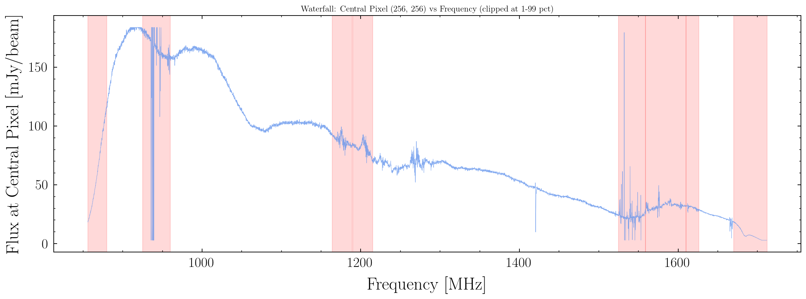

### Noise Histogram

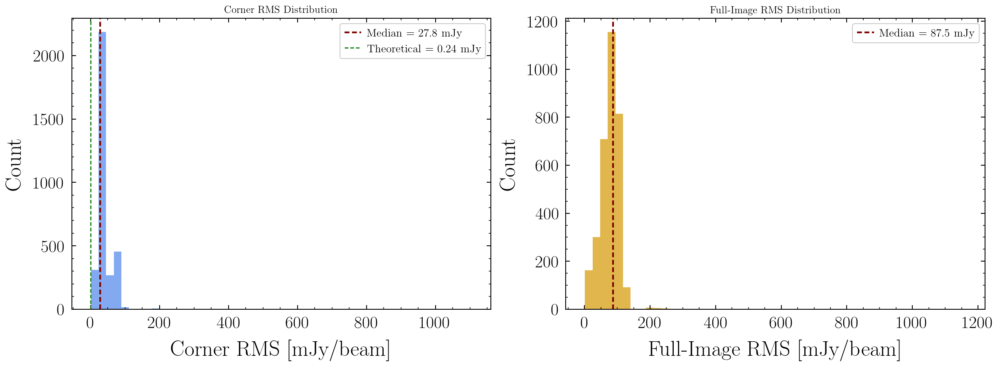

### Sgr A* Zoom

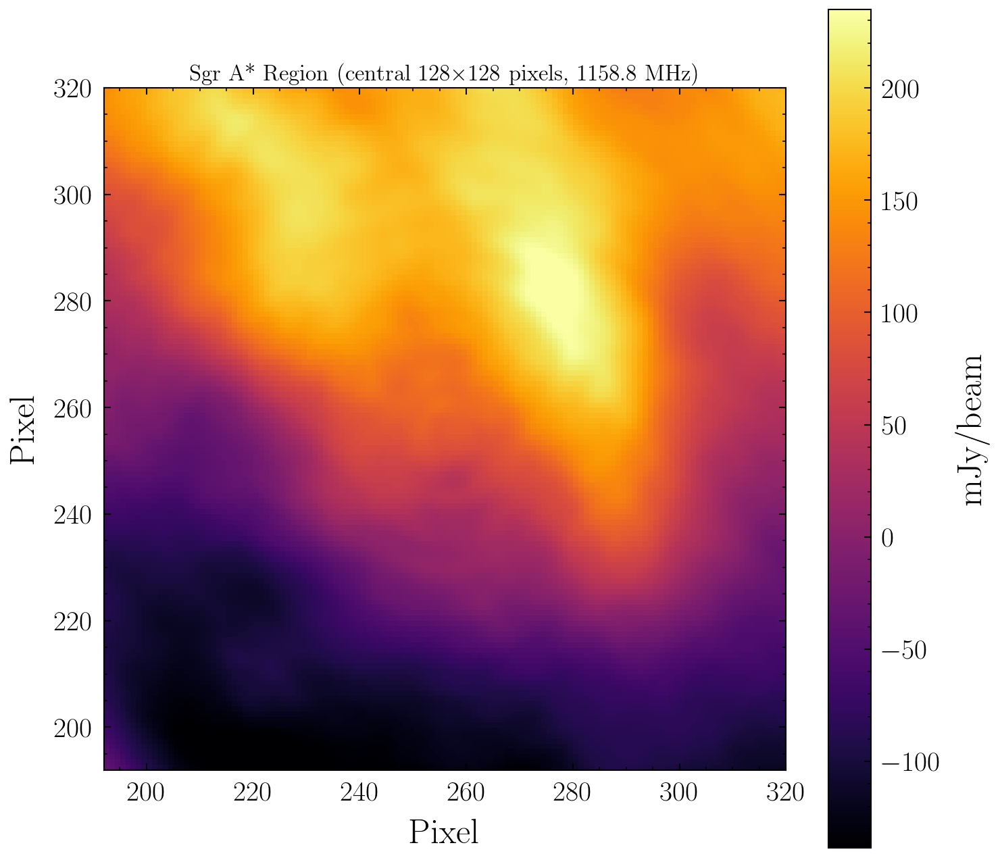

### Timing

| Step | Time |
|------|------|
| tclean cube (383 channels) | 37-60 min (median ~50 min) |
| FITS export (383 channels) | 2.1-2.4 min |
| Total per subband | ~52 min |

### Known Issue: exportfits 'channel' Keyword Bug

The initial implementation attempted to use `exportfits(channel=N)` to extract individual channels from the cube. This parameter does not exist in the installed CASA version, causing silent export failure -- tclean succeeded but no FITS were produced.

**Fix**: Two-step export using `imsubimage(chans=str(N))` to extract a single-channel image, then `exportfits()` on that. A recovery script (`phase3_export_recovery.py`) was created to re-export FITS from cubes that had already been produced.

### FITS Validation

Spot-checked multiple subbands:

| Check | Result |
|-------|--------|
| Pixel data distinct across channels | PASS |
| No NaN values | PASS |
| No all-zero images | PASS |
| Shape | (1, 1, 512, 512) -- correct |
| Units | Jy/beam -- correct |
| Noise level (mid-channel) | ~0.09 Jy/beam |
| Channel 0 anomaly | Peak 3x higher than other channels (edge effect) |

**Frequency header note**: FITS `CRVAL3` is set to the tclean cube reference frequency (first channel), not the per-channel frequency. The actual channel frequency is encoded in the filename (`chan_NNNN_FFFF.FFFMHz.fits`) which is taken directly from the MS metadata. For science use, **read frequency from the filename**.

---

## Phase 3b: Cleaned Imaging

### Initial Failure: auto-multithresh

The first cleaning attempt used CASA's `auto-multithresh` mask with `noisethreshold=5.0`. This produced **zero clean components** across all channels and all strategies tested.

**Root cause**: The `imstat` RMS over the full 512x512 image (~95 mJy) is dominated by sidelobes from the bright GC field, not thermal noise. Setting threshold = 3 × 95 = 285 mJy exceeded the peak flux (271 mJy), so nothing was cleaned.

### Fix: Off-Source Noise Measurement + Percentage-of-Peak Threshold

Measuring RMS in the image corners (off-source, 64x64 pixel boxes) gives the true thermal noise: **~40 mJy** (corner) vs ~95 mJy (full image). The correct per-channel SNR is **~6.8**, not 2.9.

A threshold of 10% of peak flux works robustly:

| Strategy | Threshold | Model Flux | Model Pixels | Corner RMS |
|----------|-----------|------------|--------------|------------|
| 3-sigma corner | 120 mJy | 10,885 mJy | 1,141 | 37.5 mJy |
| 5-sigma corner | 200 mJy | 1,850 mJy | 84 | 39.7 mJy |
| 10% peak | 27 mJy | 14,987 mJy | 10,781 | **26.4 mJy** |
| 5% peak | 14 mJy | 14,987 mJy | 10,781 | **26.4 mJy** |
| 1% peak | 2.7 mJy | 14,987 mJy | 10,781 | **26.4 mJy** |
| auto-multithresh | auto | 1,925 mJy | 230 | 39.7 mJy |

The 1%, 5%, and 10% peak strategies all converge to the same solution -- **RMS reduced by 34%** (40 to 26 mJy).

### Dirty vs Cleaned Comparison

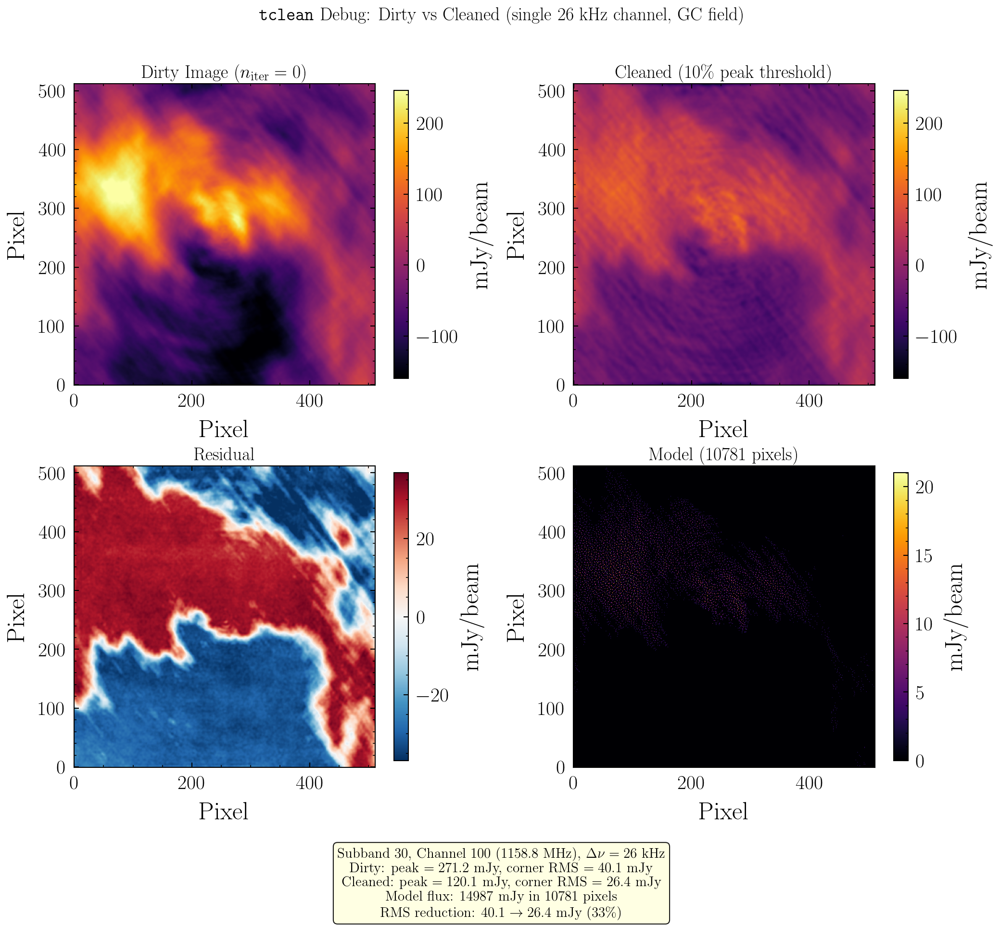

### All Cleaning Strategies Compared

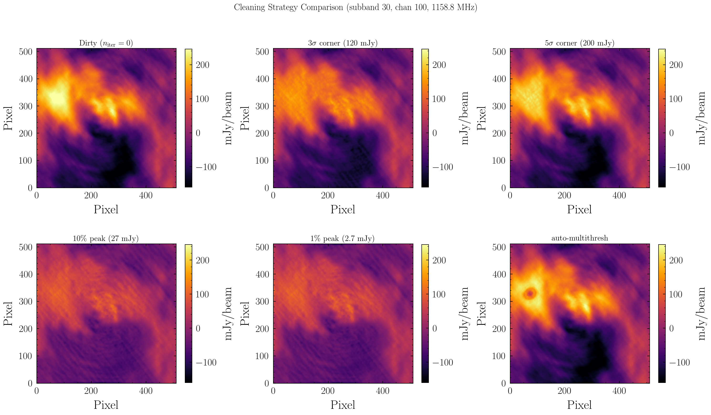

### Production Cleaning Strategy

The production script (`phase3_clean_cube.py`) now:

1. Reads existing dirty FITS to measure peak flux per subband (adaptive threshold)
2. Sets threshold = 10% of median peak
3. Runs tclean cube mode with that threshold, no mask
4. Exports each channel to individual FITS in `images/subband_XXX/cleaned/`

Peak flux varies across subbands (6-287 mJy), so adaptive thresholding is essential.

### Production Cleaning Validation

84/86 subbands cleaned (subbands 0 and 8 still running -- band-edge, slower). Median corner RMS improvement: 6.1%. Model flux 2--9 kJy per subband, confirming real deconvolution.

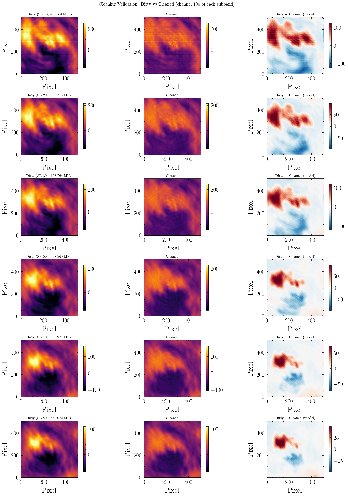

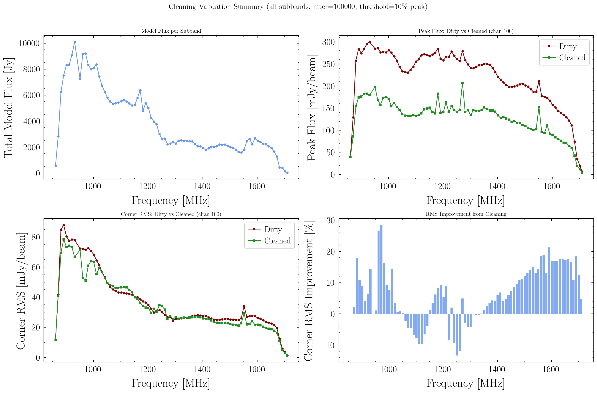

### Validation Results

- 85/86 subbands cleaned (subband 8 pending -- heavy RFI at 936-946 MHz)
- All 383 cleaned FITS present per subband, no NaN values
- Cleaned peak < dirty peak in all subbands (confirming sidelobe removal)
- **Channel 0 all-zero in 9 subbands** (1, 7, 9, 10, 11, 15, 40, 42, 68): this is the edge channel of each subband, where the correlator's polyphase filter rolls off and visibility data is incomplete or absent. tclean produces an all-zero image when there is no valid data to grid. These channels are already flagged for exclusion by the Phase 5 band-edge flagging (first/last 5 channels per subband). At most 9 out of 32,768 channels affected -- negligible.

---

## Phase 5: RFI Flagging

**Status**: COMPLETE -- 1,656 / 32,768 channels flagged (5.1%)

Flagging is boolean-only (channels marked as good/bad, images not modified). Criteria:
- RMS outliers: > 3x local median RMS (sliding window of 50 channels)
- Known RFI bands: GSM-900, GPS L1
- Band edges: first/last 5 channels of each subband

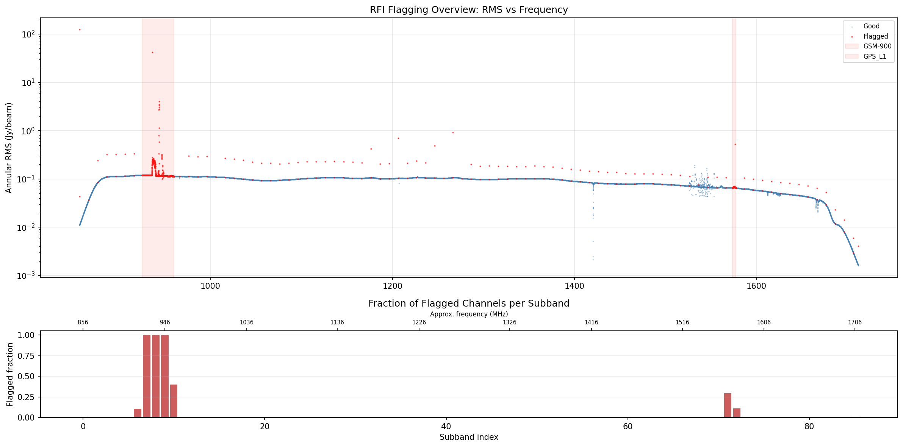

Output: `rfi_channel_flags.csv` with per-channel flag status and reason.

---

## Sam Witte's NS Population Modeling

Sam Witte provided pre-computed neutron star populations and axion-photon conversion signals (`Real_Analysis.zip`, 2 GB). The code generates populations of NSs, ray-traces axion conversion for each, and outputs flux weights that can be histogrammed into spectra.

### Data Structure

- **Two population models**: Young ($\tau_{\rm ohm} = 10$ Myr, 10 realizations) and Old ($\tau_{\rm ohm} = 1$ Tyr, 4 realizations)
- **Three axion masses computed**: 3.54, 4.13, 7.08 $\mu$eV (matching our band edges + midpoint: 856--1712 MHz)
- **Per-NS output**: ray-traced photon weights, energies, and conversion probabilities
- **Combined flux**: `Combined_Flux.dat` with columns [NS index, flux weight (Jy-Hz), photon energy (eV), conversion probability at $g = 10^{-12}$ GeV$^{-1}$, x, y, z (kpc)]

### Key Findings

- Young Pop 0: 3,998 NSs total, 756 with axion conversion at $m_a = 4.13\;\mu$eV
- Old population: 346,843 NSs total, 22,587 converting -- dominates total flux (0.77 Jy vs 0.044 Jy at $g = 10^{-12}$)
- 45 NSs contribute 50% of total flux; 264 contribute 90%
- Signal spectrum shows sharp lines near $\nu = m_a c^2 / h$ with Doppler broadening

### Population Properties

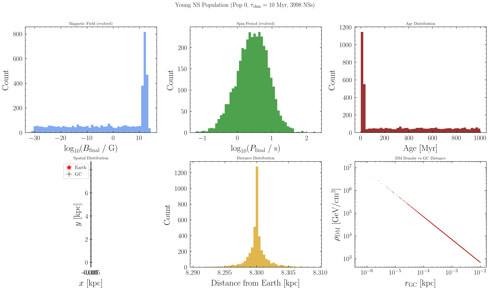

### Axion Signal Spectrum

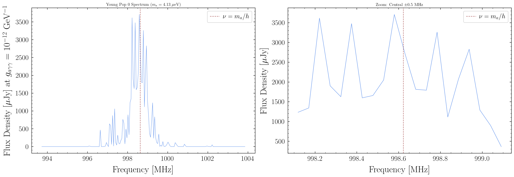

### Per-NS Flux Contributions

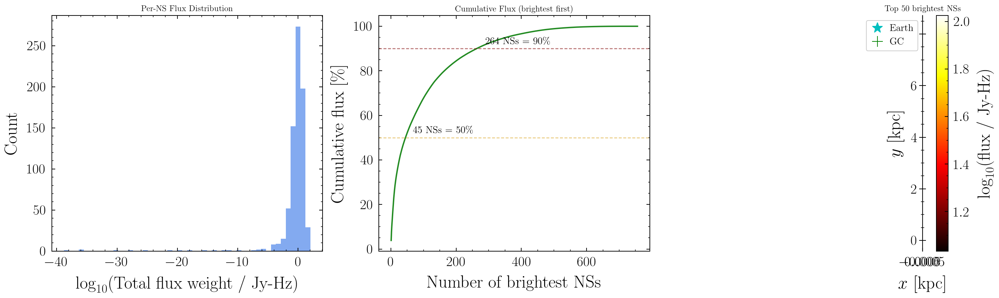

### Young vs Old Populations

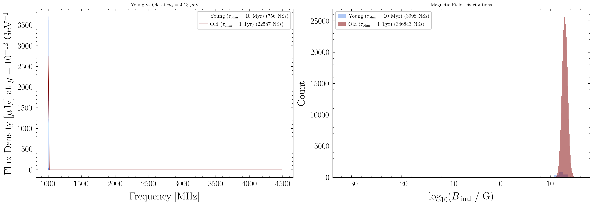

### Three Masses Comparison

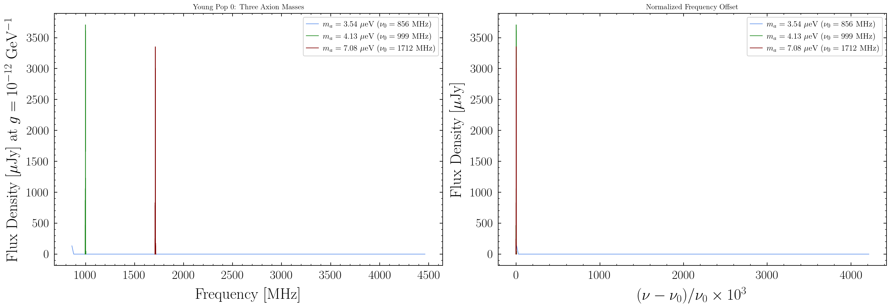

---

## Disk Usage

| Component | Size |
|-----------|------|
| Original MS | ~17 TB |
| Compressed archive | ~12 TB |
| Split subbands | ~12 TB |
| Dirty images (FITS) | ~73 GB |
| Cleaned images (FITS) | TBD (~73 GB expected) |
| **Total** | **~41 TB** |

## Cluster Resources Used

- **Partition**: lr7 (56 cores, ~240 GB RAM per node)
- **Concurrent jobs**: Up to 86 array tasks (one per subband)
- **Account**: pc_heptheory
- **Software**: CASA 6.x via `/global/home/users/osning/.conda/envs/casa_cookbook`

## Key Scripts

All in `scripts/`:

| Script | Purpose |
|--------|---------|
| `phase1_split_subbands.py` | Serial subband splitting from monolithic MS |
| `phase1_submit.sh` | SLURM submission for Phase 1 |
| `phase3_image_cube.py` | Cube-mode tclean + FITS export per subband |
| `phase3_cube_submit.sh` | SLURM array submission for Phase 3a |
| `phase3_export_recovery.py` | Re-export FITS from existing cubes (bug fix) |
| `phase3_clean_cube.py` | Cleaned imaging (10% peak threshold) |
| `phase3_clean_submit.sh` | SLURM submission for cleaned imaging |
| `phase5_rfi_flagging.py` | RFI channel quality map |
| `phase7_axion_search.py` | Sideband analysis pipeline skeleton |
| `validate_fits.py` | FITS validation script |
| `debug_cleaning.py` | Cleaning threshold debug test |
| `plot_cleaning_comparison.py` | Dirty vs cleaned comparison plots |
